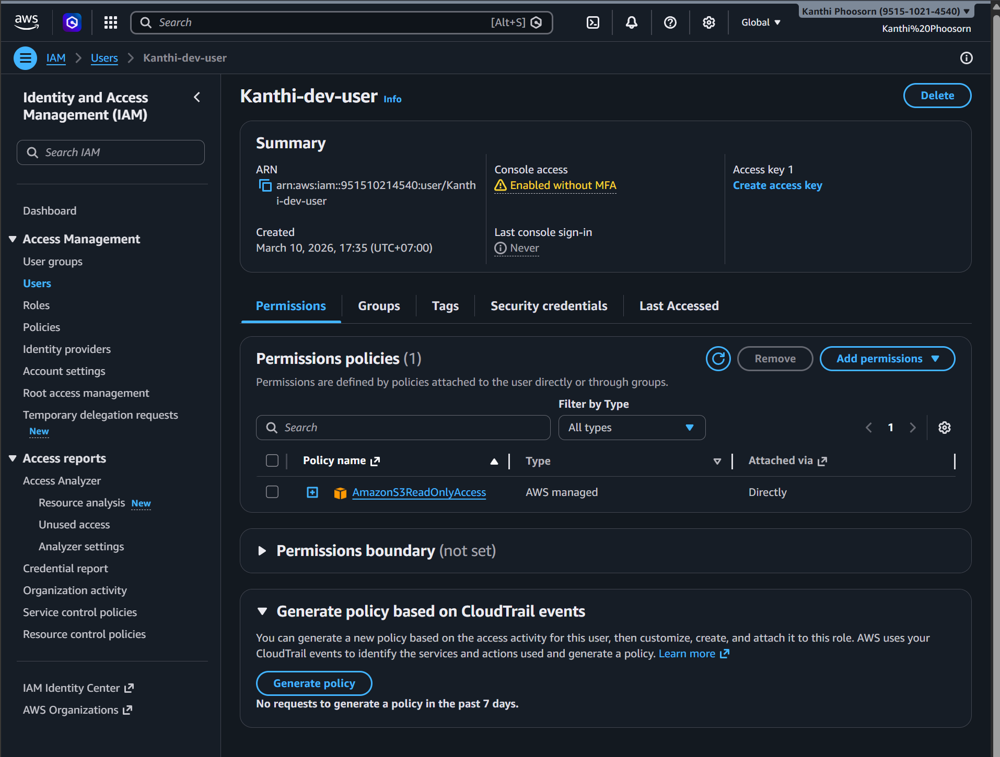
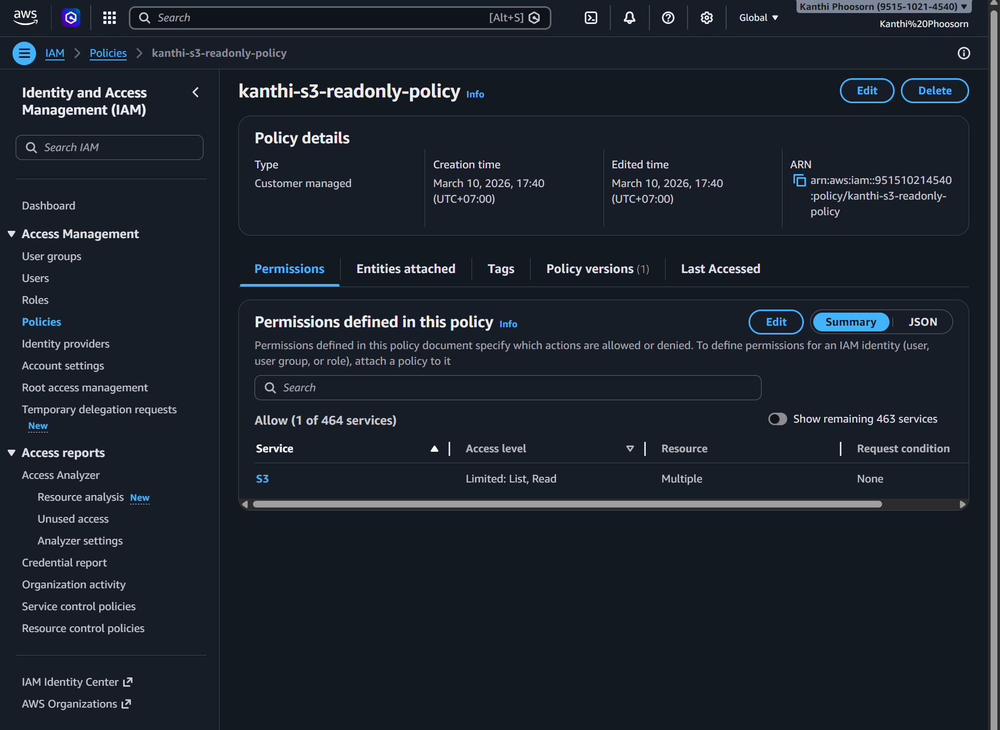

# 🔐 Project #8 — AWS IAM User + Policy Setup

**Author:** Kanthi Phoosorn  
**Date:** March 10, 2026  
**Part of:** [Cloud-Security-Engineer Portfolio](https://github.com/KanthiPhoosorn/Cloud-Security-Engineer)

## 📋 What I Did
- Created IAM user: kanthi-dev-user
- Attached AmazonS3ReadOnlyAccess policy
- Created custom JSON policy for S3 bucket access
- Configured least-privilege permissions

## 🛠️ Technologies Used
- AWS IAM
- AWS S3
- JSON Policy Editor

## 🔐 Custom Policy
```json
{
  "Version": "2012-10-17",
  "Statement": [
    {
      "Effect": "Allow",
      "Action": [
        "s3:GetObject",
        "s3:ListBucket"
      ],
      "Resource": [
        "arn:aws:s3:::kanthi-cloud-portfolio",
        "arn:aws:s3:::kanthi-cloud-portfolio/*"
      ]
    }
  ]
}
```

## 📸 Screenshots



## 💡 What I Learned
- IAM user creation and management
- Attaching managed policies to users
- Writing custom JSON IAM policies
- Principle of least privilege
- AWS security best practices

## 🔗 Related Projects
- [Project #7 — Port Scanner](https://github.com/KanthiPhoosorn/Project-7-Port-Scanner)
- [Project #9 — File Encryption Tool](https://github.com/KanthiPhoosorn/Project-9-File-Encryption-Tool)
